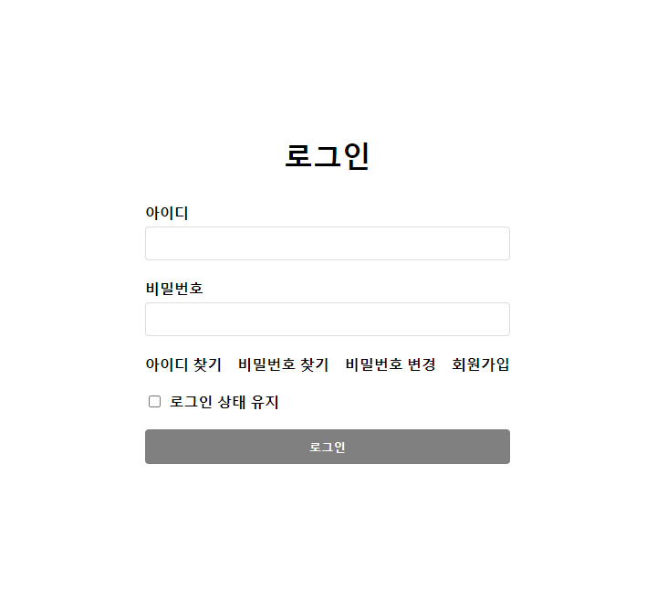
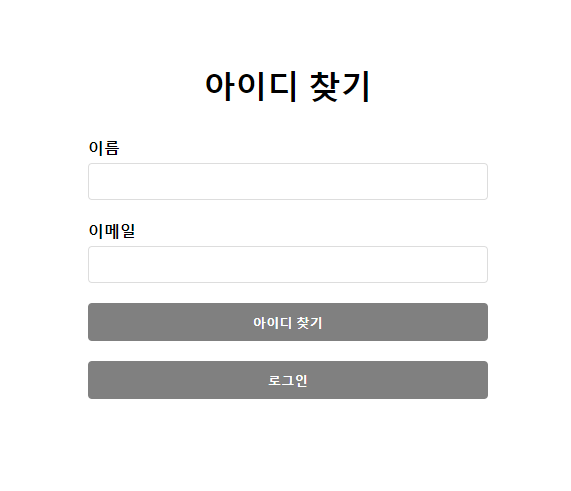
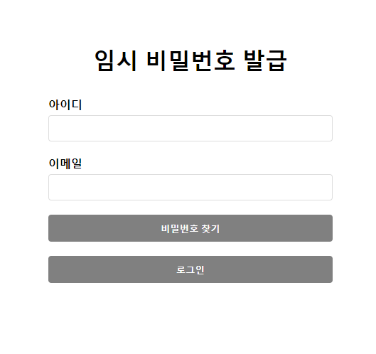
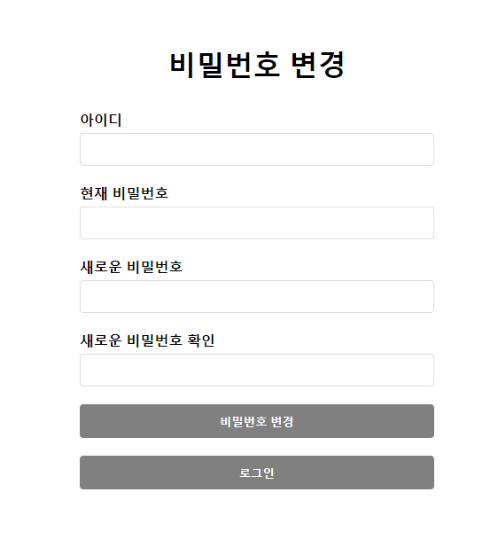
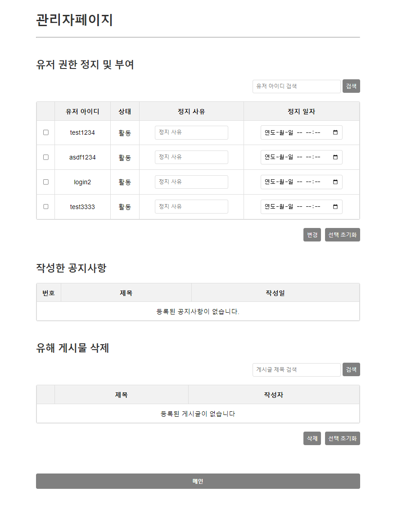
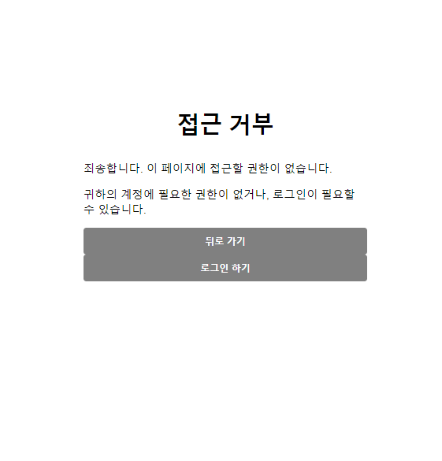
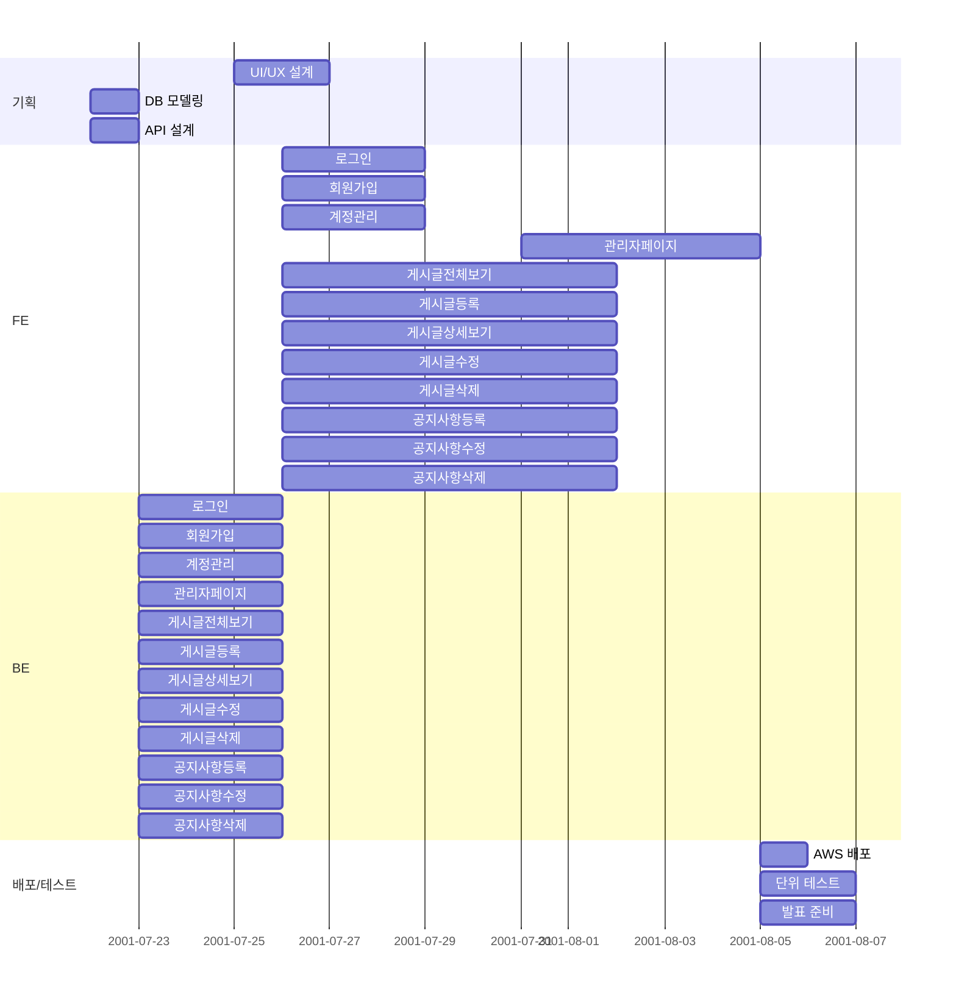
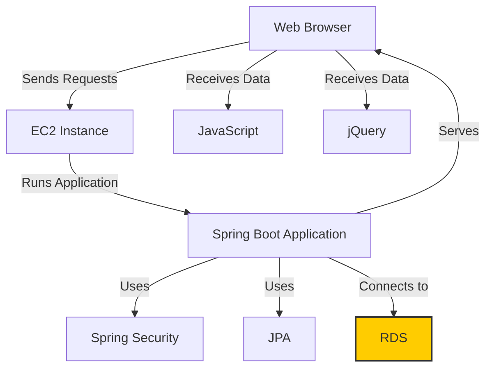

~~# 🐔 반반 자바 많이🐔

음식 리뷰 블로그 👉 링크

### **Description**
- 사용자 참여형 음식 리뷰 블로그 사이트입니다.

최근에 맛집이나 먹방에 대한 관심이 증대해지고 있고, 식문화에 대한 관심이 늘어갔기 떄문에, 사용자 중심의 리뷰를 제공해보기 위해,
회원제로 운영되는 리뷰 사이트를 만들어 보았습니다.

사용자들이 지역 기반으로 직접 작성한 리뷰를 토대로 신뢰도 있는 음식 리뷰를 작성할 수 있도록 최대한 노력하였습니다.


### 🕵️ 팀 구성 및 역할

| 담당자 | 역할 |
| --- | --- |
| 김민주 | 팀장, 화면 설계, FE/BE |
| 김성연 | 발표, FE/BE |
| 김창섭 | PPT, FE/BE |
| 김형섭 | 회의록, 설계서, FE/BE |


### 💻 개발 환경

| 항목 | 세부 내용 |
| --- | --- |
| 운영체제 | Windows OS, macOS |
| IDE | InteliJ IDEA |
| 버전 관리 | Git, GitHub |
| 프로그래밍 언어 | Java |
| 프론트엔드 | Thymeleaf, JavaScript, jQuery |
| 백엔드 | Spring Boot |
| 데이터베이스 | MySQL |
| ORM | JPA |
| 배포환경 | AWS EC2, RDS |
| 협업 도구 | Notion, dbdiagram.io, Visily |


### 🔗 데이터베이스 모델링(ERD)


### ✅ 요구 사항 명세서

| ID | 요구사항 | 상세 설명 |
| --- | --- | --- |
| REQ-001 | 로그인 | Spring Security 이용 하여 사용자 로그인 기능을 구현해야 한다. |
| REQ-002 | 회원가입 | 사용자가 웹사이트에 회원으로 가입할 수 있는 기능을 구현해야 한다. |
| REQ-002.1 | 회원정보 입력 | 회원가입 시 아이디, 비밀번호, 이름, 닉네임, 이메일 정보를 입력한다. |
| REQ-002.2 | 아이디 형식 | 아이디는 영문자와 숫자의 조합으로만 생성 가능해야 한다. |
| REQ-002.3 | 중복 확인 | 아이디와 닉네임의 중복 여부를 확인해야 한다. |
| REQ-002.4 | 비밀번호 형식 | 비밀번호는 영문자와 숫자를 조합하여 8자 이상이어야 한다. |
| REQ-003 | 아이디 찾기 | 사용자의 아이디 찾기 기능을 제공해야 한다. |
| REQ-003.1 | 아이디 발송 | 사용자가 이름과 이메일을 입력하면, 해당 이메일로 아이디를 전송해야 한다. |
| REQ-004 | 비밀번호 찾기 | 사용자에게 비밀번호 찾기 기능을 제공해야 한다. |
| REQ-004.1 | 임시 비밀번호 발급 | 사용자가 아이디와 이메일을 입력하면, 해당 이메일로 임시 비밀번호를 전송해야 한다. |
| REQ-005 | 비밀번호 변경 | 사용자가 비밀번호를 변경할 수 있도록 기능을 구현해야 한다. |
| REQ-005.1 | 새 비밀번호 설정 | 아이디와 임시 비밀번호 확인 후 새 비밀번호를 변경할 수 있도록 기능을 구현해야 한다. |
| REQ-006 | 회원 탈퇴 | 사용자가 회원 탈퇴를 할 수 있도록 기능을 구현해야 한다. |
| REQ-006.1 | 탈퇴 회원 처리 | 회원 탈퇴 시 데이터베이스에서 물리적으로 삭제 되어야 한다. |
| REQ-006.2 | 탈퇴 회원 게시글 유지 | 회원 탈퇴 후에도 해당 사용자가 작성한 게시글은 유지 되도록 기능을 구현해야 한다. |
| REQ-007 | 게시글 등록 | 사용자가 게시글을 작성하고 등록할 수 있어야 한다. |
| REQ-007.1 | 게시판 입력 | 게시판 작성 시 제목, 카테고리, 내용, 이미지 업로드, 별점, 해시태그를 입력해야 한다. |
| REQ-008 | 게시글 상세보기 | 게시글의 모든 정보를 상세 페이지에 표시하도록 구현해야 한다. |
| REQ-008.1 | 기본 정보 | 제목, 카테고리, 내용, 이미지, 별점 정보를 표시해야 한다. |
| REQ-008.2 | 메타 정보 | 날짜, 작성자 정보를 표시해야 한다. |
| REQ-008.3 | 댓글 | 해당 게시글의 달린 댓글을 표시 되도록 기능을 구현해야 한다. |
| REQ-009 | 게시글 수정 | 제목, 카테고리, 내용, 이미지, 별점,날짜 정보를 수정할 수 있도록 기능을 구현해야 한다. |
| REQ-010 | 게시글 삭제 | 사용자가 자신의 게시글을 삭제할 수 있도록 기능을 구현해야 한다. |
| REQ-011 | 댓글 작성 | 사용자가 게시글에 댓글을 작성할 수 있도록 기능을 구현해야 한다. |
| REQ-012 | 댓글 수정 | 사용자가 자신이 작성한 댓글을 수정할 수 있도록 기능을 구현해야 한다. |
| REQ-013 | 댓글 삭제 | 사용자가 자신이 작성한 댓글을 삭제할 수 있도록 기능을 구현해야 한다. |
| REQ-014 | 공지사항 | 관리자가 공지사항을 관리할 수 있도록 기능을 구현해야 한다. |
| REQ-014.1 | 공지사항 상단 고정 | 공지사항은 게시판 목록 제일 상단에 표시 되도록 기능을 구현해야 한다. |
| REQ-014.2 | 최근 공지사항 표시 | 최근 등록한 5개의 공지사항 글만 목록에 표시 되도록 기능을 구현해야 한다. |
| REQ-015 | 공지사항 | 관리자가 공지사항을 관리할 수 있도록 기능을 구현해야 한다. |
| REQ-016 | 공지사항 작성 | 관리자만 공지사항을 작성할 수 있도록 기능을 구현해야 한다. |
| REQ-017 | 공지사항 수정 | 관리자만 공지사항을 수정할 수 있도록 기능을 구현해야 한다. |
| REQ-018 | 공지사항 삭제 | 관리자만 공지사항을 삭제할 수 있도록 기능을 구현해야 한다. |
| REQ-019 | 목록 조회 | 게시판 목록은 이미지 리스트 형태로 표시 되도록 기능을 구현해야 한다. |
| REQ-019.1 | 좋아요 | 좋아요 아이콘 클릭 시 hover 효과를 주고, 클릭 시 좋아요 상태를 설정 및 해제할 수 있도록 기능을 구현해야 한다. |
| REQ-019.2 | 댓글 | 댓글 아이콘 클릭 시 해당 게시물의 상세보기 페이지로 이동하는 기능을 구현해야 한다. |
| REQ-019.3 | 별점 | 별점 아이콘을 클릭하여 사용자가 원하는 별점을 선택하거나 변경할 수 있도록 기능을 구현해야 한다. |
| REQ-019.4 | 즐겨찾기 | 즐겨찾기 아이콘 클릭 시 hover 효과를 주고, 클릭 시 즐겨찾기를 추가 및 삭제할 수 있도록 기능을 구현해야 한다. |
| REQ-019.5 | 검색 | 해시태그, 위치정보, 음식 카테고리, 날짜 범위를 조건으로 검색할 수 있도록 기능을 구현해야 한다. |
| REQ-019.6 | 정렬 | 날짜, 별점을 기준으로 목록을 정렬할 수 있도록 기능을 구현해야 한다. |
| REQ-019.7 | 페이징 | 게시판 목록에 페이징 기능을 구현해야 한다. |
| REQ-020 | 권한 관리 | 일반 사용자, 관리자, 정지 사용자에 대한 권한을 관리하는 기능을 구현해야 한다.  |
| REQ-020.1 | 일반 사용자 | 게시글 작성, 수정, 삭제(자신이 작성한 글) 권한을 부여할 수 있도록 기능을 구현해야 한다. |
| REQ-020.2 | 관리자 | 공지사항 작성, 부적절한 게시글 삭제, 유저 권한 변경, 정지 사유 등록 및 정지 일자 설정 권한을 부여할 수 있도록 기능을 구현해야 한다. |
| REQ-020.3 | 정지 사용자 | 정지일 이후 일반 권한으로 변경 되도록 기능을 구현해야 한다. |


### 📘 API 명세서

#### USERS

| **API**          | **HTTP Method** | **URL**          | **Description**                |
|------------------|-----------------|------------------|--------------------------------|
| 회원가입 페이지  | GET            | `/api/users/signupForm`     | 회원가입 페이지로 이동합니다.          |
| 사용자 등록              | POST           | `/api/users`                | 사용자를 등록합니다.                   |
| 아이디 중복 체크              | GET         | `/api/users/checkDuplicateId`           | 회원가입 시 아이디를 중복 체크합니다.              |
| 닉네임 중복 체크              | GET         | `/api/users/checkDuplicateNickname`           | 회원가입 시 닉네임을 중복 체크합니다.             |
| 이메일 중복 체크              | GET        | `/api/users/checkDuplicateEmail`           | 회원가입 시 이메일을 중복 체크합니다.             |
| 아이디찾기 페이지              | GET          | `/api/users/findAccountForm`           | 아이디찾기 페이지로 이동합니다.             |
| 아이디 전송              | POST         | `/api/users/findAccount`           | 이메일로 아이디를 전송합니다.             |
| 임시 비밀번호 발급 페이지              |  GET        | `/api/users/findPasswordForm`           | 임시 비밀번호 발급 페이지로 이동합니다.             |
| 임시 비밀번호 전송              | POST         | `/api/users/findPassword`           | 이메일로 임시 비밀번호를 전송합니다.             |
| 비밀번호 변경 페이지              | GET         | `/api/users/resetPasswordForm`           | 비밀번호 변경 페이지로 이동합니다.             |
| 비밀번호 변경              | POST         | `/api/users/resetPassword`           | 비밀번호를 변경합니다.             |
| 로그인 페이지              | GET         | `/api/users/login`           | 로그인 페이지로 이동합니다.             |
| 회원탈퇴 페이지              | GET         | `/api/users/withdrawForm`           | 회원탈퇴 페이지로 이동합니다.             |
| 회원탈퇴              | POST         | `/api/users/withdraw`           | 회원탈퇴를 합니다.             |
| 접근 불가 페이지              | GET         | `/api/users/accessDenied`           | 사용자가 접근할 수 없는 리소스에 접근하려고 할 때 표시됩니다. |
| 관리자 페이지              | GET         | `/api/users/admin`           | 관리자 페이지로 이동합니다.             |
| 권한 변경(정지)              | PUT         | `/api/users/admin/unActivate/{userId}`           | 사용자의 권한을 '정지' 권한으로 변경합니다.             |
| 권한 변경(일반)              | PUT          | `/api/users/admin/activate/{userId}`           | 사용자의 권한을 '일반' 권한으로 변경합니다.             |
| 사용자 전체 조회              | GET         | `/api/users/admin/getUser/list`           | 전체 사용자의 정보를 가져옵니다.             |
| 특정 사용자 조회              | GET         | `/api/users/admin/getUser/{id}`           | 특정 사용자의 정보를 가져옵니다.             |
| 사용자 검색              | GET         | `/api/users/admin/users/search/{userId}`           | 검색한 사용자 정보를 가져옵니다.             |


#### POSTS
| **API**     | **HTTP Method** | **URL**          | **Description**               |
|-------------|-----------------|------------------|-------------------------------|
| 게시글 등록      | POST         | `/api/posts`           | 게시글을 등록합니다.                   |
| 게시글 조회      | GET         | `/api/posts/all`           | 전체 게시글을 조회합니다.                |
| 게시글 상세 조회   | GET         | `/api/posts/{id}`           | 특정 게시글을 조회합니다.                |
| 특정 게시글 조회   | GET         | `/api/posts/get`           | 특정 게시글의 세부정보를 가져와 ViEW로 반환한다. |
| 게시글 수정 페이지  | GET         | `/api/posts/updateForm`           | 특정 게시글의 수정 VIEW를 반환한다.        |
| 게시글 삭제      | DELETE         | `/api/posts/{postId}`           | 게시글을 삭제합니다.                   |
| 게시글 수정      | PUT         | `/api/posts/update/{id}`           | 게시글을 수정합니다.                   |
| 게시글 목록      | GET         | `/api/posts/search`           | 검색, 정렬 조건에 따라 게시물 검색하여 목록 반환  |
| 공지사항 등록     | POST          | `/api/posts/notice/save`           | 공지사항을 등록합니다.                  |
| 공지사항 수정     | PUT         | `/api/posts/notice/update/{id}`           | 공지사항을 수정합니다.                  |
| 공지사항 삭제     | DELETE         | `/api/posts/notice/delete/{id}`           | 공지사항을 삭제합니다.                  |
| 공지사항 조회     | GET         | `/api/posts/admin/notice`           | 공지사항만 조회합니다.                  |
| 게시글 조회      | GET         | `/api/posts/admin/posts`           | 게시글만 조회합니다.                   |
| 게시글 검색      | GET         | `/api/posts/admin/posts/search/{title}`           | 검색한 게시글 정보를 가져옵니다.            |
| 공지사항 등록 페이지 | GET         | `/api/posts/noticeForm`           | 공지사항 등록 페이지로 이동합니다.           |
| 공지사항 수정 페이지 | GET         | `/api/posts/noticeUpdateForm`           | 공지사항 수정 페이지로 이동합니다.           |

#### Comments
| **API**          | **HTTP Method** | **URL**          | **Description**                |
|------------------|-----------------|------------------|--------------------------------|
| 댓글 조회              | GET         | `/api/comments/get/{postId}`           | 댓글을 조회합니다.             |
| 댓글 수정              | PUT         | `/api/comments/update/{commentId}`           | 댓글을 수정합니다.             |
| 댓글 삭제              | DELETE          | `/api/comments/delete/{commentId}`           | 댓글을 삭제합니다.             |
| 댓글 등록              | POST         | `/api/comments/nonreply`           | 댓글을 등록합니다.             |
| 대댓글 등록              | POST          | `/api/comments/reply`           | 대댓글을 등록합니다.             |

#### Images
| **API**          | **HTTP Method** | **URL**          | **Description**                |
|------------------|-----------------|------------------|--------------------------------|
| 이미지 업로드              | POST         | `/api/images/upload`           | 이미지를 업로드합니다.             |
| 이미지 삭제              | DELETE         | `/api/images/delete`           | 이미지를 삭제합니다.             |
| 이미지 상세 조회              | GET         | `/api/images/get`           | 특정 이미지를 조회합니다.             |
| 요청 이미지              | GET         | `/api/images/display/{filename}`           | 요청한 이미지 파일을 반환합니다.             |

#### Bookmarks
| **API**   | **HTTP Method** | **URL**          | **Description**                    |
|-----------|-----------------|------------------|------------------------------------|
| 북마크 조회    | GET         | `/api/bookmarks`           | 특정 사용자의 북마크 목록을 조회합니다.             |
| 북마크 여부 확인 | GET         | `/api/bookmarks/get`           | 특정 게시물에 대해 로그인한 사용자의 북마크 여부를 확인한다. |
| 북마크 저장    | POST         | `/api/bookmarks/save`           | 북마크를 저장합니다.                        |
| 북마크 삭제    | DELETE         | `/api/bookmarks/delete`           | 북마크를 삭제합니다.                        |

#### Prefers
| **API**       | **HTTP Method** | **URL**          | **Description**             |
|---------------|-----------------|------------------|-----------------------------|
| 좋아요 개수        | GET             | `/api/prefers/counts`           | 특정 사용자의 '좋아요' 개수를 조회합니다.    |
| 좋아요 조회        | GET             | `/api/prefers`           | 특정 사용자의 전체 '좋아요' 목록을 조회합니다. |
| 특정 게시물 좋아요 조회 | GET             | `/api/prefers/get`           | 특정 게시물을 좋아요 하는지 조회한다.       |
| 좋아요 등록        | POST            | `/api/prefers/save`           | 특정 게시물의 '좋아요'를 등록합니다.       |
| 좋아요 삭제        | DELETE          | `/api/prefers/delete`           | 특정 게시물의 '좋아요'를 삭제합니다.       |


### 🖼️ 화면 설계서


| 로그인                                              | 회원가입                                               |
|--------------------------------------------------|----------------------------------------------------|
|  |  |

| 아이디 찾기                                                    | 임시 비밀번호 발급                                                     |
|-----------------------------------------------------------|----------------------------------------------------------------|
|  |  |

| 비밀번호 변경                                                      | 회원 탈퇴                                                 |
|--------------------------------------------------------------|-------------------------------------------------------|
|  |  |

| 게시물 전체 보기 | 게시물 생성 |
|--------|----------|
|  |  |

| 게시물 수정 | 게시물 상세보기(다른 사용자 게시물) |
|--------|----------|
|  |  |

| 게시물 상세보기(내 게시물) | 공지사항 생성 |
|--------|----------|
|  |  |

| 공지사항 수정 | 공지사항 상세보기(일반 유저)                                                           |
|--------|----------------------------------------------------------------------------|
|  |  |

| 공지사항 상세보기(관리자)                                                            | 관리자 페이지                                              |
|---------------------------------------------------------------------------|------------------------------------------------------|
|  |  |


| 접근 불가                                                              |
|--------------------------------------------------------------------|
|  |

### 📂 프로젝트 구조

```
📁 src
├── 📁 main
│   ├── 📁 java
│   │   └── 📁 com
│   │       └── 📁 springProject
│   │           ├── 📁 config
│   │           │   ├── 📜 QuerydslConfig.java
│   │           │   └── 📜 SecurityConfig.java
│   │           ├── 📁 controller
│   │           │   ├── 📜 BookMarksController.java
│   │           │   ├── 📜 CommentsController.java
│   │           │   ├── 📜 PostImagesController.java
│   │           │   ├── 📜 PostsController.java
│   │           │   ├── 📜 PrefersController.java
│   │           │   └── 📜 UsersController.java
│   │           ├── 📁 dto
│   │           │   ├── 📜 BannedDateReasonForm.java
│   │           │   ├── 📜 BookMarksDto.java
│   │           │   ├── 📜 CommentsDto.java
│   │           │   ├── 📜 CommentWithParent.java
│   │           │   ├── 📜 DeletePostsDto.java
│   │           │   ├── 📜 MessageDto.java
│   │           │   ├── 📜 NickAndLoginId.java
│   │           │   ├── 📜 PostImagesDto.java
│   │           │   ├── 📜 PostsDto.java
│   │           │   ├── 📜 PostsWithUser.java
│   │           │   ├── 📜 PrefersDto.java
│   │           │   └── 📜 UsersDto.java
│   │           ├── 📁 entity
│   │           │   ├── 📜 BannedUser.java
│   │           │   ├── 📜 BookMarks.java
│   │           │   ├── 📜 Comments.java
│   │           │   ├── 📜 DeletePosts.java
│   │           │   ├── 📜 PostImages.java
│   │           │   ├── 📜 Posts.java
│   │           │   ├── 📜 Prefers.java
│   │           │   └── 📜 Users.java
│   │           ├── 📁 repository
│   │           │   ├── 📜 BannedUserRepository.java
│   │           │   ├── 📜 BookMarksRepository.java
│   │           │   ├── 📜 CommentsRepository.java
│   │           │   ├── 📜 PostImagesRepository.java
│   │           │   ├── 📜 PostsRepository.java
│   │           │   ├── 📜 PostsRepositoryCustom.java
│   │           │   ├── 📜 PostsRepositoryImpl.java
│   │           │   ├── 📜 PrefersRepository.java
│   │           │   └── 📜 UsersRepository.java
│   │           ├── 📁 service
│   │           │   ├── 📜 BookMarksService.java
│   │           │   ├── 📜 CommentsService.java
│   │           │   ├── 📜 CustomUserDetailsService.java
│   │           │   ├── 📜 EmailService.java
│   │           │   ├── 📜 PostImagesService.java
│   │           │   ├── 📜 PostsService.java
│   │           │   ├── 📜 PrefersService.java
│   │           │   └── 📜 UsersService.java
│   │           ├── 📁 utils
│   │           │   └── 📜 ConvertUtils.java
│   │           └── 📜 SearchData.java
│   ├── 📁 resources
│   │   ├── 📁 static
│   │   │   ├── 📁 css
│   │   │   │   ├── 📜 account.css
│   │   │   │   ├── 📜 admin.css
│   │   │   │   ├── 📜 createForm.css
│   │   │   │   ├── 📜 postDetails.css
│   │   │   │   ├── 📜 postUpdate.css
│   │   │   │   ├── 📜 search.css
│   │   │   │   └── 📜 signup.css
│   │   │   ├── 📁 docs
│   │   │   │   ├── 📜 accessDenied.png
│   │   │   │   ├── 📜 admin.png
│   │   │   │   ├── 📜 erd.png
│   │   │   │   ├── 📜 findAccount.png
│   │   │   │   ├── 📜 login.png
│   │   │   │   ├── 📜 resetPassword.png
│   │   │   │   ├── 📜 signup.png
│   │   │   │   ├── 📜 tempPassword.png 
│   │   │   │   └── 📜 withdraw.png
│   │   │   ├── 📁 img
│   │   │   │   ├── 📜 after_bookmark.svg
│   │   │   │   ├── 📜 after_prefer.svg
│   │   │   │   ├── 📜 before_bookmark.svg
│   │   │   │   ├── 📜 before_prefer.svg
│   │   │   │   ├── 📜 bookmark_off.png
│   │   │   │   ├── 📜 bookmark_on.png
│   │   │   │   ├── 📜 dummylmg.png
│   │   │   │   ├── 📜 notice_pin.svg
│   │   │   │   ├── 📜 prefer_off.png
│   │   │   │   ├── 📜 prefer_on.png
│   │   │   │   ├── 📜 reply.png
│   │   │   │   ├── 📜 star.png
│   │   │   │   ├── 📜 star1.png
│   │   │   │   ├── 📜 star2.png
│   │   │   │   ├── 📜 star3.png
│   │   │   │   ├── 📜 star4.png
│   │   │   │   └── 📜 star5.png
│   │   │   └── 📁 js
│   │   │       └── 📜 search.js
│   │   ├── 📁 templates
│   │   │   ├── 📁 account
│   │   │   │   ├── 📜 findAccount.html
│   │   │   │   ├── 📜 resetPassword.html
│   │   │   │   ├── 📜 tempPassword.html
│   │   │   │   └── 📜 withdraw.html
│   │   │   ├── 📁 login
│   │   │   │   ├── 📜 accessDenied.html
│   │   │   │   ├── 📜 login.html
│   │   │   │   ├── 📜 main.html
│   │   │   │   └── 📜 signup.html
│   │   │   ├── 📁 personalPage
│   │   │   │   └── 📜 admin.html
│   │   │   ├── 📁 post
│   │   │   │   ├── 📜 createForm.html
│   │   │   │   ├── 📜 createNotice.html
│   │   │   │   ├── 📜 noticeUpdate.html
│   │   │   │   └── 📜 search.html
│   │   │   ├── 📁 postsDetails
│   │   │   │   ├── 📜 myPost.html
│   │   │   │   └── 📜 postUpdateForm.html
│   │   └── 📜 application.yml
│   └── 📁 test
│       └── 📁 java
│           └── 📁 com
│               └── 📁 springProject
│                   ├── 📁 controller
│                   │   └── 📜 PostsControllerTest.java
│                   ├── 📁 main
│                   │   └── 📜 SpringBootApplicationTests.java
│                   └── 📁 service
│                       └── 📜 PostsServiceTest.java
├── 📜 .gitignore
├── 📜 build.gradle
├── 📜 gradlew
├── 📜 gradlew.bat
├── 📜 README.md
└── 📜 settings.gradle
```

### 📅 개발 일정


### 🏛️ Architecture


### 🎞️ 시연 영상
